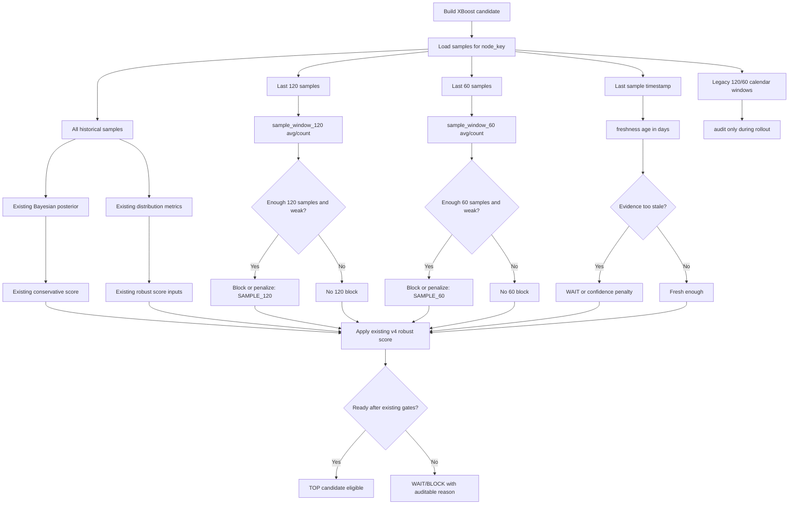

# Plan: Pandora XBoost Sample Window Scoring

**Generated**: 2026-06-27
**Status**: Completed on 2026-06-27
**Estimated Complexity**: High / Trading-Sensitive

## Overview

Refine Pandora XBoost v4 so recent robustness is evaluated with deterministic
sample windows instead of relying only on calendar-day rolling windows. The
goal is to reduce ambiguity from gaps, filtered datasets, low-frequency nodes,
and uneven trading calendars while preserving the existing v4 Bayesian/robust
scoring shape.

This plan must avoid a major model rewrite. The current v4 core remains the
source of truth:

- aggregate stats by `node_key`;
- Bayesian posterior and uncertainty penalty;
- depth penalty;
- robust score with fragility, payoff credit, forward penalty, and broker
  degradation;
- TOP candidate selection and broker admission rules.

The intended refinement is:

```text
primary recent windows: last 60 samples and last 120 samples per node_key
temporal guard: last sample age/freshness, used as a confidence check
legacy calendar windows: retained for audit during rollout
```

The sample-window logic should not create new user inputs initially. Use
internal constants first and expose the metrics in logs/audit so Strategy
Tester runs can compare old and new behavior before broad live use.

## Sample Contract

One XBoost sample is one completed branch/node result, not one complete daily
tree. The sample identity is date-idempotent and includes:

```text
strategy_key | root_date | node_path | depth | side | close_event
```

That means a single root day can produce multiple samples when different
branches or depths close. Sample-window scoring must therefore aggregate by
`node_key`, not by root day and not by the whole tree. A `last_60_samples`
window means the newest 60 closed samples for that same `node_key`.

## Design Diagram



## Prerequisites

- Current XBoost v4 plan is completed and archived:
  `docs/plans/archive/pandora-xboost-robust-forward-scoring-plan.md`.
- Keep current XBoost CSV storage compatible unless a later sprint explicitly
  justifies a schema bump.
- Preserve `Pandora_XBoost_Mode` behavior:
  - `TRAINING`: record local branch statistics only.
  - `INFERENCE`: train adaptively and allow broker entries when candidates are
    ready.
- Preserve no-SQLite storage and Common Files CSV persistence.
- Preserve current Strategy ID behavior; do not force users to change IDs for
  audit-only sprints.
- Do not add MQL5 CI/test harnesses. Use static validation and one final
  MetaEditor compile gate.

## Sprint Execution Policy

- Execute Sprints in order.
- Complete validation before moving to the next Sprint.
- Create one brief commit per completed Sprint before continuing, unless the
  user explicitly forbids commits or git is unavailable.
- Because this changes trading candidate decisions, execute one Sprint per
  batch by default.
- Do not compile after every Sprint. Run MetaEditor compile only in the final
  Sprint unless a syntax-sensitive change clearly needs earlier compilation.
- After compile validation, inspect and remove `BUILD.log`.

## Sprint 1: Sample Window Contract

**Goal**: Define the exact sample-window semantics without changing runtime
decisions.
**Commit**: `docs: define XBoost sample window scoring contract`
**Demo/Validation**:

- Static review confirms the contract distinguishes samples from calendar days.
- No MQL5 runtime behavior changes.

### Task 1.1: Document Sample Identity

- **Location**: `docs/plans/pandora-xboost-sample-window-scoring-plan.md`
- **Description**: Capture the current meaning of one XBoost sample: one closed
  branch/node result identified by strategy, root date, node path, depth, side,
  and close event.
- **Dependencies**: None.
- **Acceptance Criteria**:
  - The plan states that one day/root can produce multiple samples across
    different nodes/depths.
  - The plan states that sample windows are computed per `node_key`.
- **Validation**:
  - Review against `PandoraXBoostBuildSampleId()` and
    `PandoraXBoostRecordClosedSignal()`.

### Task 1.2: Define Window Constants

- **Location**: `services/trading_signals/pandora_xboost_state.mqh`
- **Description**: Plan constants for sample windows and freshness without
  exposing new inputs.
- **Dependencies**: Task 1.1.
- **Acceptance Criteria**:
  - Proposed constants are internal only:
    - `PANDORA_XBOOST_SAMPLE_WINDOW_120 = 120`
    - `PANDORA_XBOOST_SAMPLE_WINDOW_60 = 60`
    - a conservative freshness constant to be confirmed during implementation.
  - No optimization/user-facing inputs are added.
- **Validation**:
  - Static review of constant naming and input list.

## Sprint 2: Audit-Only Aggregators

**Goal**: Add last-N sample aggregation fields and helpers without affecting TOP
selection or broker decisions.
**Commit**: `feat: audit XBoost last sample windows`
**Demo/Validation**:

- XBoost candidates still use existing v4 decision gates.
- Logs expose both legacy calendar windows and new sample windows.

### Task 2.1: Add Candidate Audit Fields

- **Location**: `services/trading_signals/pandora_xboost_state.mqh`
- **Description**: Add inert candidate fields for sample-window metrics.
- **Dependencies**: Sprint 1.
- **Acceptance Criteria**:
  - Candidate can store:
    - last 120 sample count and average R;
    - last 60 sample count and average R;
    - last sample age in days;
    - optional freshness status/reason.
  - Copy/default constructors preserve the fields.
  - Fields are initialized deterministically.
- **Validation**:
  - Static constructor/copy review.

### Task 2.2: Implement Last-N Node Aggregation

- **Location**: `services/trading_signals/pandora_xboost_state.mqh`
- **Description**: Add helper logic to aggregate the newest N samples for a
  `node_key`, ordered by `seen_at`.
- **Dependencies**: Task 2.1.
- **Acceptance Criteria**:
  - Helper ignores unrelated node keys.
  - Helper handles fewer than N available samples.
  - Helper does not mutate the global sample array.
  - Helper remains cheap enough for candidate evaluation; avoid unbounded
    repeated sorting if a simple newest-N scan is sufficient.
- **Validation**:
  - Static review against `g_pandora_xboost_sample_rows`.

### Task 2.3: Populate Audit Metrics

- **Location**: `services/trading_signals/pandora_xboost_state.mqh`
- **Description**: Compute sample-window metrics inside candidate construction
  while leaving scoring and statuses unchanged.
- **Dependencies**: Task 2.2.
- **Acceptance Criteria**:
  - Existing `local_window_60/120` calendar metrics are unchanged.
  - New sample metrics are populated for logs only.
  - No candidate `READY`, `WAIT`, or `BLOCK` outcome changes in this Sprint.
- **Validation**:
  - Static diff review confirms no decision gate references new fields.

## Sprint 3: Audit Visibility

**Goal**: Make sample-window behavior visible enough to compare against the
legacy rolling-day windows in short and long Strategy Tester runs.
**Commit**: `feat: log XBoost sample window audit metrics`
**Demo/Validation**:

- `Enable_File_Logs=true` shows sample-window metrics in query debug output.
- Panel/comment remains compact and does not become noisy.

### Task 3.1: Extend Candidate Logs

- **Location**: `services/trading_signals/pandora_xboost_state.mqh`
- **Description**: Add sample-window metrics to TOP candidate debug lines.
- **Dependencies**: Sprint 2.
- **Acceptance Criteria**:
  - Logs show both old and new metrics, for example:
    - `w120_days=...`
    - `w60_days=...`
    - `s120=...`
    - `s60=...`
    - `age=...`
  - Reason labels remain readable.
- **Validation**:
  - Static review of `PandoraXBoostLogTopCandidates()` formatting.

### Task 3.2: Extend Audit Snapshots Only If Stable

- **Location**: `services/trading_signals/pandora_xboost_storage.mqh`
- **Description**: If existing run/node audit snapshot rows can safely accept
  extra columns without breaking loaders, add sample-window metrics there.
  Otherwise keep the metrics in query debug only.
- **Dependencies**: Task 3.1.
- **Acceptance Criteria**:
  - No required stats/sample CSV loader schema changes.
  - `_stats.csv`, `_samples.csv`, and `_broker_trades.csv` stay backward
    compatible.
  - Any audit-only header change is documented in the plan execution notes.
- **Validation**:
  - Static review of CSV readers and writers.

**Execution Note**: Keep loader-backed CSV schemas unchanged unless later manual
QA proves summary columns are needed. Query debug candidate lines are sufficient
for the first audit pass and preserve storage compatibility.

## Sprint 4: Sample Windows As Recent-Robustness Gate

**Goal**: Use last-N sample windows as the primary recent robustness gate while
keeping the existing v4 Bayesian and robust score logic intact.
**Commit**: `feat: use sample windows for XBoost recent robustness`
**Demo/Validation**:

- Candidate status changes are limited to recent-window/freshness reasons.
- Existing Bayesian posterior, robust score, broker degradation, and TOP ranking
  mechanics remain intact.

### Task 4.1: Add Sample Window Gate

- **Location**: `services/trading_signals/pandora_xboost_state.mqh`
- **Description**: Replace decision use of calendar-day rolling windows with
  sample-window checks.
- **Dependencies**: Sprint 3.
- **Acceptance Criteria**:
  - If last 60 samples are available at or above the depth min sample threshold
    and average R is below the conservative floor, candidate blocks with an
    auditable reason such as `SAMPLE_60`.
  - If last 120 samples are available at or above the depth min sample threshold
    and average R is below the conservative floor, candidate blocks with
    `SAMPLE_120`.
  - If sample windows do not have enough samples, they do not block by
    themselves.
  - Legacy rolling-day windows remain logged for comparison but are not the
    primary recent robustness gate.
- **Validation**:
  - Static trace from `PandoraXBoostBuildCandidate()` through candidate status.

### Task 4.2: Add Freshness Guard

- **Location**: `services/trading_signals/pandora_xboost_state.mqh`
- **Description**: Add a simple time-based confidence guard so very old sample
  evidence cannot appear current merely because last-N windows are populated.
- **Dependencies**: Task 4.1.
- **Acceptance Criteria**:
  - Freshness uses `last_seen` / newest sample timestamp.
  - Freshness does not create extra user inputs.
  - Freshness behavior is conservative and simple:
    - `WAIT` if evidence is stale and samples are insufficient for recent
      confidence, or
    - small internal penalty if evidence is stale but otherwise robust.
  - Reason labels distinguish sample weakness from stale evidence.
- **Validation**:
  - Static review of status/score mutation order.

## Sprint 5: Documentation And Manual QA Guide

**Goal**: Update user-facing documentation so backtest interpretation is clear
and the model remains auditable.
**Commit**: `docs: document XBoost sample window scoring`
**Demo/Validation**:

- Guides explain sample windows without adding math ambiguity.
- Manual QA scenarios are clear enough for short and long Strategy Tester runs.

### Task 5.1: Update Pandora Guides

- **Location**:
  - `docs/guides/pandora_box_guide_en.md`
  - `docs/guides/pandora_box_guide_es.md`
  - `docs/guides/pandora-box-strategy-inputs.md`
- **Description**: Document that recent robustness is based on last-N samples per
  node, with freshness as a confidence guard.
- **Dependencies**: Sprint 4.
- **Acceptance Criteria**:
  - Spanish and English guides distinguish:
    - one sample;
    - one root day;
    - one node/rama;
    - calendar-day audit windows;
    - sample-window decision gates.
  - No new user input documentation is added unless implementation introduced
    an input, which this plan currently avoids.
- **Validation**:
  - Static docs review.

### Task 5.2: Add Tester Audit Checklist

- **Location**: `docs/guides/pandora_box_guide_es.md`
- **Description**: Add a compact checklist for validating sample-window behavior
  after a short inference run and a long deep-data run.
- **Dependencies**: Task 5.1.
- **Acceptance Criteria**:
  - Checklist includes expected log fields and reason labels.
  - Checklist states that old calendar windows should be compared during rollout
    but are not the primary decision gate.
- **Validation**:
  - Static docs review.

## Sprint 6: Final Compile And Review Gate

**Goal**: Validate the sample-window scoring refinement with the project compile
gate and focused static review.
**Commit**: `chore: validate XBoost sample window scoring`
**Execution Status**: Completed on 2026-06-27.
**Demo/Validation**:

- MetaEditor compile passes with zero errors and warnings.
- `BUILD.log` is inspected and removed.

### Task 6.1: Static Trading-Safety Review

- **Location**:
  - `services/trading_signals/pandora_xboost_state.mqh`
  - `services/trading_signals/pandora_xboost_storage.mqh`
  - `docs/guides/*`
- **Description**: Review candidate status flow and storage compatibility before
  compiling.
- **Dependencies**: Sprints 1-5.
- **Acceptance Criteria**:
  - No order lifecycle, broker send, stop/trailing, session, protection, license,
    or magic-number behavior changes outside XBoost candidate scoring.
  - Disabled mode remains inert.
  - Training mode still records local samples.
  - Inference mode still trains adaptively and opens broker trades only for
    ready candidates.
- **Validation**:
  - Static diff review.

### Task 6.2: MetaEditor Compile

- **Location**: `HFT_Grid_AI.mq5`
- **Description**: Compile the EA using the project gate.
- **Dependencies**: Task 6.1.
- **Acceptance Criteria**:
  - Compile command:

```powershell
& "C:\Program Files\MetaTrader 5-1\MetaEditor64.exe" /compile:"C:\Program Files\MetaTrader 5-1\MQL5\Experts\HFT_Grid_AI\HFT_Grid_AI.mq5" /log:"C:\Program Files\MetaTrader 5-1\MQL5\Experts\HFT_Grid_AI\BUILD.log"
```

  - `BUILD.log` reports zero errors and zero warnings.
  - `BUILD.log` is removed after review.
- **Validation**:
  - Compile log inspection.

### Sprint 6 Execution Notes

- Static review confirmed the sample-window fields only affect XBoost candidate
  scoring and logging; broker lifecycle, storage schemas, trailing, sessions,
  protection, license, and magic-number paths were not changed.
- Final compile was run with the same entrypoint and `BUILD.log` gate plus
  `/portable`, so MetaEditor used the install-local MQL5 include tree.
- `BUILD.log` reported `Result: 0 errors, 0 warnings` and was removed after
  inspection.

## Testing Strategy

- No MQL5 CI/test harness will be added.
- Sprints 1-5 use static review and focused grep/diff checks.
- Sprint 6 runs the MetaEditor compile gate.
- Manual Strategy Tester QA after implementation should include:
  - a short 5-day inference run with `Enable_File_Logs=true`;
  - a longer 2024-now inference run;
  - a deep-data run after the clean dataset is ready;
  - comparison of old calendar metrics and new sample-window metrics in logs.

Expected audit focus:

- `s60` and `s120` counts represent samples for the same `node_key`, not days.
- Candidate blocks caused by new gates use `SAMPLE_60`, `SAMPLE_120`, or a clear
  freshness reason.
- Calendar windows remain visible for audit during rollout.
- TOP 3 behavior remains stable unless sample-window evidence justifies a
  different READY/BLOCK outcome.

## Potential Risks & Gotchas

- Deep nodes may not have 60 or 120 samples for a long time. Mitigation: sample
  windows only block when they have at least the existing depth-specific minimum
  sample threshold.
- Last-N samples can include old market regimes for rare nodes. Mitigation:
  freshness guard remains simple and conservative.
- Changing recent-window gates can alter broker trade frequency. Mitigation:
  audit-only Sprints 2-3 precede decision changes.
- Adding columns to loader-backed CSV files can break compatibility. Mitigation:
  keep stats/samples/broker files unchanged unless a schema bump is explicitly
  approved.
- Overfitting risk increases with too many knobs. Mitigation: no new user inputs
  and no multi-layer Bayesian temporal cascade in this plan.

## Rollback Plan

- Revert Sprint commits in reverse order.
- If decision behavior changes too much, revert Sprint 4 first while keeping
  audit-only Sprints 1-3 for diagnostics.
- If logs become too noisy, revert Sprint 3 formatting only.
- Existing XBoost CSV stats/samples remain valid because this plan does not
  require changing the core storage schema.
