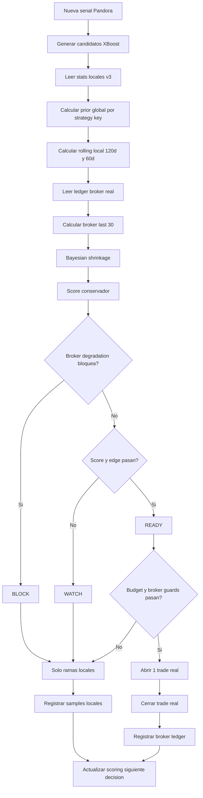

# Plan: Pandora XBoost Bayesian Rolling TOP Methodology

**Generated**: 2026-06-23
**Estimated Complexity**: Critical / Trading-Sensitive
**Status**: Draft ready for Sprint execution

## Overview

Upgrade Pandora XBoost from simple expectancy/edge ranking to a conservative
Bayesian rolling methodology for real broker inference. The local progression
tree remains the broad discovery model because it observes every simulated
branch. A new real broker ledger calibrates and degrades that model using only
positions that XBoost actually selected for broker execution.

The goal is not to make a curve-fit optimizer. The goal is to make TOP
selection more honest:

- Use local tree stats to discover candidate branches with enough coverage.
- Use Bayesian shrinkage so low-sample branches are pulled toward a broader
  prior instead of looking artificially strong.
- Use fixed rolling windows to detect recent degradation without choosing the
  best-looking period after the fact.
- Use real broker results as a conservative calibration layer, not as the only
  model source, because broker-selected trades are sparse and selection-biased.
- Keep the candidate states simple: `READY`, `WATCH`, and `BLOCK`.
- If TOP 1 is blocked or not ready, allow TOP 2 or TOP 3 to execute when that
  candidate is `READY` and normal broker guards pass.
- Do not add a separate regime filter in this plan. Avoid sample fragmentation
  until the base Bayesian/ledger model is validated.
- Do not add a separate global kill switch in this plan. Candidate/preset
  degradation is handled by the scoring and status gates. A future kill switch
  can be added only for systemic safety rules if manual QA proves it is needed.

This plan uses schema `v3` so the new model and ledger are not mixed with the
existing `v2` XBoost CSV files.

## Recommended Model Relationship

Use the local XBoost tree as the primary discovery source and the real broker
ledger as a conservative calibration source.

Reasoning:

- The local tree has broad coverage because it records all local branches.
- The broker ledger is higher quality for execution reality, but it only
  records branches the model already selected. That makes it selection-biased.
- If the broker ledger becomes the only ranking source too early, good branches
  that were not selected previously can be starved of real samples.
- If the local tree remains primary without broker calibration, the model can
  keep trusting simulated branches that do not hold up when actually traded.

Therefore:

```text
candidate_score = local Bayesian model score
                  - uncertainty penalty
                  - fixed depth penalty
                  - real broker degradation penalty
```

The broker ledger can block or degrade a candidate, but it should not promote a
weak local candidate into `READY` by itself.

## Confirmed Decisions

- Include a broker lifecycle cleanup Sprint to reduce audit noise such as
  post-close modify attempts and close attempts after a position no longer
  exists.
- Add a real-only XBoost broker ledger CSV.
- Use Common file storage under the existing `PandoraXBoost` folder structure.
- Use fixed rolling windows:
  - global history
  - last 120 days
  - last 60 days
  - last 30 real broker trades
- Use Bayesian shrinkage with conservative prior weights aligned with the
  current experimental sample thresholds:
  - depth 1: `30`
  - depth 2: `20`
  - depth 3: `12`
- Do not add a regime key/filter in this plan.
- Do not add a separate public kill-switch input in this plan.
- Keep validation discipline unchanged:
  - one Sprint per batch for execution
  - commit after each completed Sprint
  - no MQL5 test/CI harness
  - compile only in the final compile/correction Sprint

## Non-Goals

- Do not implement SQLite, external services, Python preprocessing, or external
  model runtimes.
- Do not create a train/offline optimizer.
- Do not tune windows or thresholds to fit the already-seen 2026 forward period.
- Do not introduce a regime filter in this plan.
- Do not change the single-active-XBoost-broker-position rule.
- Do not bypass broker, license, symbol, magic, spread, margin, session,
  drawdown, market-status, or protection guards.
- Do not replace local tree statistics with broker-only statistics.

## Data And Scoring Contracts

### Schema Version

Set `PANDORA_XBOOST_SCHEMA_VERSION = 3` for this methodology.

Existing `v2` CSV files remain untouched and are not migrated automatically.
Users can intentionally copy/archive external runtime data if needed, but source
code should not mix `v2` and `v3` model rows.

### Local Model Stats

The existing local `_samples.csv` remains the rolling source of truth for local
model windows:

```text
sample_id,node_key,close_event,r_multiple,seen_at
```

The aggregate `_stats.csv` should be extended in `v3` only when needed for
cheap global calculations, for example:

```text
node_key,key_hash,samples,wins,losses,be,total_r,sum_r2,avg_r,
avg_win_r,avg_loss_r,max_win_r,max_loss_r,max_drawdown_r,
expectancy_r,last_seen
```

`sum_r2` allows standard error estimation without rescanning every historical
sample for global stats.

### Real Broker Ledger

Add a separate close-only real ledger for XBoost broker-selected positions:

```text
broker_trade_id,strategy_key,root_id,root_date,node_key,node_path,
sample_id,depth,broker_trade_index,side,entry_time,close_time,
entry_price,close_price,sl_points,r_multiple_broker,net_profit,
close_event,close_reason,model_score_r,model_posterior_r,
model_samples,broker_window_samples,seen_at
```

Notes:

- One row represents one completed real broker XBoost position.
- Open selections continue to be visible in `query_debug.txt`.
- An active live trade is not final ledger evidence until it closes.
- `r_multiple_broker` is required.
- `net_profit` is best-effort from available broker/deal data; if reliable deal
  profit is not available in a path, the row should still be written with the
  deterministic R multiple and a clear reason in debug logs.

### Bayesian Shrinkage

Use a simple empirical Bayes style formula:

```text
prior_avg_r = strategy/global average R for the same strategy key
prior_weight = depth-specific constant

posterior_avg_r =
  ((node_samples * node_avg_r) + (prior_weight * prior_avg_r))
  / (node_samples + prior_weight)
```

Use conservative uncertainty when enough variance data exists:

```text
standard_error_r = sqrt(variance_r / effective_samples)
conservative_model_r = posterior_avg_r - (uncertainty_z * standard_error_r)
```

Fallback when variance is unavailable:

```text
conservative_model_r = posterior_avg_r - fixed_uncertainty_floor_r
```

Initial code-level constants should stay private, not public inputs:

```text
PANDORA_XBOOST_BAYES_PRIOR_WEIGHT_DEPTH_1 = 30
PANDORA_XBOOST_BAYES_PRIOR_WEIGHT_DEPTH_2 = 20
PANDORA_XBOOST_BAYES_PRIOR_WEIGHT_DEPTH_3 = 12
PANDORA_XBOOST_BAYES_UNCERTAINTY_Z = 1.0
PANDORA_XBOOST_BAYES_MIN_CONSERVATIVE_R = 0.03
PANDORA_XBOOST_BROKER_DEGRADATION_FLOOR_R = -0.05
PANDORA_XBOOST_BROKER_DEGRADATION_WEIGHT = 1.0
```

Promote these constants to inputs only after manual QA proves the defaults need
runtime tuning.

### Rolling Windows

Rolling windows are part of business logic, not just manual forward testing.
They must be computed from data available up to the current tester/live time.

Use windows as fixed confirmation/degradation gates:

- Global local model: broad prior and base score.
- Local 120-day window: medium-term confirmation.
- Local 60-day window: recent confirmation.
- Broker last 30 real trades: real execution degradation calibration.

Do not choose the best window dynamically. That would be overfitting. Each
window has a predefined role.

### Candidate Status Rules

Candidate state should be deterministic and explainable:

```text
WAIT:
  Not enough local model samples for the depth.

WATCH:
  Enough samples, but conservative score, edge, or rolling confirmation is not
  strong enough for real execution.

BLOCK:
  Local Bayesian score is below floor, rolling windows show clear recent
  degradation, or real broker ledger shows enough negative degradation.

READY:
  Local Bayesian score passes, edge passes, rolling confirmation does not
  block, broker degradation does not block, and existing broker budget/active
  trade guards allow execution.
```

## Expected Panel Example

The chart/tester summary should stay compact. Example:

```text
XBOOST INFERENCE v3 root=L day=2026.06.23 d=2 broker=1/3
XB data stats=86 samples=4417 broker=184 Common\mt5_xxx\us_30_v1
XB1 L-TTPL2 READY n=72 p=0.18 c=0.11 br30=0.06
XB2 S-TTPL2 WATCH n=41 p=0.04 c=-0.01 reason=EDGE
XB3 L-TBES BLOCK n=56 p=0.09 c=-0.08 reason=BROKER_30
```

Where:

- `p` is posterior average R.
- `c` is conservative score R after uncertainty/depth/degradation penalties.
- `br30` is broker last-30 calibration when available.
- `reason` explains why a non-ready candidate is not tradable.

## Flow Diagram



## Prerequisites

- Read `AGENTS.md` and `docs/planner-execution-discipline.md` before execution.
- Execute exactly one Sprint per batch because this plan is trading-sensitive.
- Create one brief commit per completed Sprint before moving to the next Sprint.
- Do not compile after intermediate Sprints.
- Compile only in Sprint 10.
- Do not add an MQL5 test/CI harness.
- Manual Strategy Tester/live QA remains owned by the user after implementation.

## Sprint 1: Broker Lifecycle Audit Cleanup

**Goal**: Remove known audit noise around post-close modify/close attempts so
the new broker ledger is easier to trust.
**Commit**: `Sprint 1: clean XBoost broker lifecycle audit noise`
**Demo/Validation**:
- No compile in this Sprint.
- Static review confirms closed or missing broker positions do not trigger
  repeated modify/close failures.
- Existing broker, magic, symbol, and protection guards remain intact.

### Task 1.1: Guard Broker Stop Sync For Missing Positions

- **Location**:
  - `microservices/trading_signals/grid_order_lifecycle.mqh`
- **Description**: Harden the path around `GridSyncPandoraBrokerStops()` so a
  missing selected position clears or marks the local broker stop-sync state
  once, then avoids repeated modify attempts for the same closed ticket.
- **Dependencies**: None.
- **Acceptance Criteria**:
  - A missing position after close does not produce repeated modify attempts.
  - The signal still closes and records its XBoost sample normally.
  - Broker failure logging stays visible but not noisy.
- **Validation**:
  - Static trace through `PositionSelectByTicket`, stop sync state, and close
    completion paths.

### Task 1.2: Guard Broker Close For Already Closed Positions

- **Location**:
  - `microservices/trading_signals/grid_order_lifecycle.mqh`
  - `services/trading_signals/protection_risk_filter.mqh`
- **Description**: Make close paths treat a missing already-closed position as a
  completed local close when symbol/magic/ticket state confirms there is no
  active broker position to close.
- **Dependencies**: Task 1.1.
- **Acceptance Criteria**:
  - No false retry loop for tickets that no longer exist.
  - Real broker close failures still register when a position exists and close
    fails.
  - XBoost broker-active state is released once after close.
- **Validation**:
  - Static trace through normal close, force close, and XBoost release.

### Task 1.3: Add Compact Lifecycle Diagnostics

- **Location**:
  - `microservices/trading_signals/grid_order_lifecycle.mqh`
  - `services/trading_signals/pandora_xboost_storage.mqh`
- **Description**: Add compact `query_debug.txt` diagnostics for missing-ticket
  cleanup and suppressed duplicate close/modify attempts.
- **Dependencies**: Tasks 1.1-1.2.
- **Acceptance Criteria**:
  - Logs identify context, ticket, and action without account/license data.
  - Logs remain event-level only, not per tick.
- **Validation**:
  - Static review of log labels and sensitive data exposure.

## Sprint 2: XBoost v3 Contracts And Inert Broker Ledger State

**Goal**: Add schema v3 contracts and in-memory structs without changing
candidate decisions yet.
**Commit**: `Sprint 2: add XBoost v3 Bayesian contracts`
**Demo/Validation**:
- No compile in this Sprint.
- Static review confirms default behavior is unchanged except v3 file naming
  when XBoost is enabled.

### Task 2.1: Bump Schema And Constants

- **Location**:
  - `services/trading_signals/pandora_xboost_state.mqh`
- **Description**: Set XBoost schema to `3` and add private constants for
  Bayesian prior weights, uncertainty, rolling windows, and broker degradation.
- **Dependencies**: Sprint 1.
- **Acceptance Criteria**:
  - v3 file prefix does not collide with v2.
  - Constants are code-level only.
  - Existing public inputs are not expanded.
- **Validation**:
  - Static review of file prefix, strategy key, and constants.

### Task 2.2: Extend Candidate And Runtime Scoring Fields

- **Location**:
  - `services/trading_signals/pandora_xboost_state.mqh`
  - `services/trading_signals/signal_params_struct.mqh`
- **Description**: Add inert fields for posterior score, conservative score,
  rolling sample counts, broker ledger counts, and broker ledger id.
- **Dependencies**: Task 2.1.
- **Acceptance Criteria**:
  - Constructors and copy constructors initialize/copy every new field.
  - Existing `score_r` remains usable until Sprint 5 switches scoring logic.
  - No broker execution behavior changes yet.
- **Validation**:
  - Constructor/copy review.

### Task 2.3: Add Broker Ledger Row Struct

- **Location**:
  - `services/trading_signals/pandora_xboost_state.mqh`
  - `services/trading_signals/pandora_xboost_storage.mqh`
- **Description**: Add an in-memory real broker ledger row struct and arrays for
  loaded closed broker trades.
- **Dependencies**: Task 2.2.
- **Acceptance Criteria**:
  - Struct includes all CSV fields required for scoring and audit.
  - No file IO is added yet beyond existing load/save calls.
- **Validation**:
  - Static struct field and lifecycle review.

## Sprint 3: Real Broker Ledger Persistence

**Goal**: Load and save a real-only XBoost broker ledger in Common storage.
**Commit**: `Sprint 3: add XBoost broker ledger persistence`
**Demo/Validation**:
- No compile in this Sprint.
- Static review confirms ledger writes happen only on broker-selected completed
  XBoost positions.

### Task 3.1: Add Broker Ledger CSV Helpers

- **Location**:
  - `services/trading_signals/pandora_xboost_storage.mqh`
- **Description**: Add filename, header, load, append, dedupe, and save helpers
  for `*_broker_trades.csv`.
- **Dependencies**: Sprint 2.
- **Acceptance Criteria**:
  - Uses existing Common folder helpers.
  - Malformed rows are skipped with compact diagnostics.
  - Duplicate `broker_trade_id` values are ignored.
  - File handles always close.
- **Validation**:
  - Static review of `FileOpen`, `FileReadString`, `FileWrite`, and dedupe
    paths.

### Task 3.2: Build Deterministic Broker Trade IDs

- **Location**:
  - `services/trading_signals/pandora_xboost_state.mqh`
  - `services/trading_signals/pandora_xboost_storage.mqh`
- **Description**: Build `broker_trade_id` from strategy key, root date, node
  path, depth, broker trade index, side, and broker fill/open time where
  available.
- **Dependencies**: Task 3.1.
- **Acceptance Criteria**:
  - Same deterministic tester replay does not double-count closed broker trades.
  - Different days or branch paths create distinct broker trade IDs.
- **Validation**:
  - Static review of id construction and replay idempotency.

### Task 3.3: Load And Save Broker Ledger In XBoost Lifecycle

- **Location**:
  - `HFT_Grid_AI.mq5`
  - `services/trading_signals/pandora_xboost_storage.mqh`
- **Description**: Integrate broker ledger load/save with existing XBoost load
  and save lifecycle.
- **Dependencies**: Task 3.2.
- **Acceptance Criteria**:
  - XBoost load includes stats, samples, and broker ledger.
  - XBoost save includes pending local samples and pending broker ledger rows.
  - `PANDORA_XBOOST_SAVE` logs broker ledger row counts.
- **Validation**:
  - Static trace through `OnInit`, `OnDeinit`, and sample flush.

## Sprint 4: Broker Ledger Recording On Real XBoost Close

**Goal**: Record one broker ledger row for each completed XBoost broker-selected
position.
**Commit**: `Sprint 4: record real XBoost broker trades`
**Demo/Validation**:
- No compile in this Sprint.
- Static review confirms local-only branches never write broker ledger rows.

### Task 4.1: Capture Broker Selection Snapshot

- **Location**:
  - `services/trading_signals/pandora_xboost_state.mqh`
  - `services/trading_signals/signal_params_struct.mqh`
- **Description**: Store the candidate score snapshot used at broker selection:
  model samples, posterior score, conservative score, and selected rank.
- **Dependencies**: Sprint 3.
- **Acceptance Criteria**:
  - Broker-selected signal carries enough data to write a ledger row at close.
  - Local-only branches do not carry broker ledger ids.
- **Validation**:
  - Static trace from `PandoraXBoostApplyBrokerDecision()` to signal close.

### Task 4.2: Compute Broker Real R Multiple

- **Location**:
  - `services/trading_signals/pandora_xboost_storage.mqh`
  - `services/trading_signals/pandora_xboost_state.mqh`
- **Description**: Compute `r_multiple_broker` from broker fill price, close
  price, side, and deterministic SL points. Fall back to local close price only
  when broker close price is unavailable and log the fallback.
- **Dependencies**: Task 4.1.
- **Acceptance Criteria**:
  - Uses existing Pandora SL/price helpers.
  - Handles long and short symmetrically.
  - Does not record a broker ledger row with zero/invalid SL points.
- **Validation**:
  - Static math review for long/short R calculation.

### Task 4.3: Append Broker Ledger Row After Close

- **Location**:
  - `services/trading_signals/pandora_xboost_storage.mqh`
  - `services/trading_signals/tick_signals_manager.mqh`
  - `services/trading_signals/protection_risk_filter.mqh`
- **Description**: Extend the existing XBoost close recording path so broker
  selected signals also append one closed broker ledger row.
- **Dependencies**: Task 4.2.
- **Acceptance Criteria**:
  - One broker ledger row per completed broker-selected XBoost trade.
  - Force-close/protection close paths record close reason.
  - Dedupe prevents replay double-counting.
  - Local sample recording remains unchanged.
- **Validation**:
  - Static trace through normal close and protection force close.

## Sprint 5: Rolling Local Model Windows

**Goal**: Compute local model rolling stats from XBoost samples at candidate
decision time.
**Commit**: `Sprint 5: add XBoost rolling model windows`
**Demo/Validation**:
- No compile in this Sprint.
- Static review confirms window scans occur only on candidate build/close
  events, not every tick.

### Task 5.1: Store Loaded Sample Rows For Rolling Queries

- **Location**:
  - `services/trading_signals/pandora_xboost_state.mqh`
  - `services/trading_signals/pandora_xboost_storage.mqh`
- **Description**: Add a lightweight in-memory sample row array containing
  `node_key`, `r_multiple`, and `seen_at` from loaded and newly recorded
  samples.
- **Dependencies**: Sprint 4.
- **Acceptance Criteria**:
  - Existing sample ID dedupe remains authoritative.
  - Pending new samples are visible to rolling queries after they are recorded.
  - Array growth uses reserve sizes.
- **Validation**:
  - Static review of load, append, reset, and memory growth.

### Task 5.2: Add Rolling Aggregation Helpers

- **Location**:
  - `services/trading_signals/pandora_xboost_state.mqh`
- **Description**: Add event-level helpers to aggregate by `node_key` and cutoff
  date for global, 120-day, and 60-day local windows.
- **Dependencies**: Task 5.1.
- **Acceptance Criteria**:
  - Helpers return samples, total R, average R, variance inputs, and last seen.
  - Empty or under-sampled windows return explicit status.
  - No chart/log side effects inside aggregation helpers.
- **Validation**:
  - Static review of cutoff math and `TimeCurrent()` usage.

### Task 5.3: Add Strategy-Level Prior Aggregation

- **Location**:
  - `services/trading_signals/pandora_xboost_state.mqh`
- **Description**: Compute the strategy/global prior average for the same
  strategy key, excluding incompatible schema versions by construction.
- **Dependencies**: Task 5.2.
- **Acceptance Criteria**:
  - Prior uses v3 data only.
  - If no prior exists, prior average falls back to `0.0`.
  - Prior computation does not promote under-sampled nodes to `READY`.
- **Validation**:
  - Static review of strategy key matching and fallback logic.

## Sprint 6: Bayesian Candidate Scoring

**Goal**: Replace simple expectancy scoring with deterministic Bayesian
shrinkage and conservative scoring.
**Commit**: `Sprint 6: apply Bayesian XBoost candidate scoring`
**Demo/Validation**:
- No compile in this Sprint.
- Static review confirms candidate scoring is explainable and fixed-window
  based.

### Task 6.1: Implement Posterior Score Helper

- **Location**:
  - `services/trading_signals/pandora_xboost_state.mqh`
- **Description**: Implement posterior average and uncertainty helpers using
  depth-specific prior weights and available variance inputs.
- **Dependencies**: Sprint 5.
- **Acceptance Criteria**:
  - Formula is deterministic.
  - Low sample nodes shrink toward the strategy/global prior.
  - Uncertainty penalty cannot become negative or NaN.
- **Validation**:
  - Static formula review and edge-case review for zero samples/variance.

### Task 6.2: Replace Candidate Score Fields

- **Location**:
  - `services/trading_signals/pandora_xboost_state.mqh`
- **Description**: Populate candidate posterior, conservative score, rolling
  sample counts, and reason fields in `PandoraXBoostBuildCandidate()`.
- **Dependencies**: Task 6.1.
- **Acceptance Criteria**:
  - Candidate status no longer depends on raw `expectancy_r` alone.
  - `score_r` maps to conservative score for existing sort paths.
  - Candidate logs include posterior and conservative score.
- **Validation**:
  - Static trace from candidate build to sort and broker selection.

### Task 6.3: Update Edge Logic For Bayesian Scores

- **Location**:
  - `services/trading_signals/pandora_xboost_state.mqh`
- **Description**: Make edge comparisons use conservative score and fixed
  minimum edge, not raw expectancy.
- **Dependencies**: Task 6.2.
- **Acceptance Criteria**:
  - A candidate can only become `READY` if conservative score and edge pass.
  - An alternative candidate with stronger conservative score prevents weak
    selection.
  - Top 2 or Top 3 can still execute if they are `READY` and the matching
    branch is the current branch.
- **Validation**:
  - Static trace through `PandoraXBoostApplyCandidateEdge()` and
    `PandoraXBoostFindReadyCandidateForSignal()`.

## Sprint 7: Broker Degradation Calibration Gate

**Goal**: Use real broker ledger rows to degrade or block candidates without
creating a separate global kill switch.
**Commit**: `Sprint 7: calibrate XBoost scoring with broker ledger`
**Demo/Validation**:
- No compile in this Sprint.
- Static review confirms broker ledger can block/degrade but cannot promote a
  weak local candidate into `READY`.

### Task 7.1: Aggregate Broker Ledger By Candidate

- **Location**:
  - `services/trading_signals/pandora_xboost_state.mqh`
  - `services/trading_signals/pandora_xboost_storage.mqh`
- **Description**: Add helpers to aggregate closed broker ledger rows by
  `node_key` and by latest N real broker trades for the same strategy key.
- **Dependencies**: Sprint 6.
- **Acceptance Criteria**:
  - Aggregation uses closed broker rows only.
  - Latest-30 ordering is deterministic by close time.
  - Empty ledger returns neutral calibration.
- **Validation**:
  - Static review of sort/order assumptions and fallback behavior.

### Task 7.2: Apply Broker Degradation Penalty

- **Location**:
  - `services/trading_signals/pandora_xboost_state.mqh`
- **Description**: Penalize conservative score when broker recent performance is
  meaningfully worse than local model performance.
- **Dependencies**: Task 7.1.
- **Acceptance Criteria**:
  - Broker degradation lowers score or sets `BLOCK` when enough real broker
    samples exist and performance is below floor.
  - Broker data does not increase score above local Bayesian score.
  - Candidate reason identifies `BROKER_30`, `BROKER_NODE`, or equivalent.
- **Validation**:
  - Static scoring review with no-ledger, good-ledger, and bad-ledger cases.

### Task 7.3: Treat No Ready Candidate As The Operational Kill Gate

- **Location**:
  - `services/trading_signals/pandora_xboost_state.mqh`
  - `services/trading_signals/pandora_xboost_progression.mqh`
- **Description**: Keep the existing behavior where no `READY` candidate means
  no broker trade, while local branches continue collecting stats. Do not add a
  separate public kill-switch input.
- **Dependencies**: Task 7.2.
- **Acceptance Criteria**:
  - A bad recent broker window blocks/degrades candidates until none may be
    `READY`.
  - Local branch training continues even on blocked days.
  - Logs make it clear why no real broker position opened.
- **Validation**:
  - Static trace through broker selection skip reasons.

## Sprint 8: Panel And Query Debug Audit Visibility

**Goal**: Make the new TOP methodology auditable in Strategy Tester and chart
panel without expanding the UI beyond useful compact lines.
**Commit**: `Sprint 8: show Bayesian XBoost TOP audit fields`
**Demo/Validation**:
- No compile in this Sprint.
- Static review confirms the panel remains compact and does not hide existing
  market status information.

### Task 8.1: Extend XBoost Dryrun Logs

- **Location**:
  - `services/trading_signals/pandora_xboost_state.mqh`
  - `services/trading_signals/pandora_xboost_storage.mqh`
- **Description**: Add posterior, conservative score, rolling window counts,
  broker last-30 values, and block reason to `PANDORA_XBOOST_DRYRUN`.
- **Dependencies**: Sprint 7.
- **Acceptance Criteria**:
  - Logs show enough data to audit why a candidate was READY/WATCH/BLOCK.
  - Logs avoid account/license data.
  - Logs remain event-level.
- **Validation**:
  - Static log review.

### Task 8.2: Update Panel Summary Lines

- **Location**:
  - `services/trading_signals/pandora_xboost_state.mqh`
  - `services/frontend/pandora_box_panel.mqh`
- **Description**: Update `PandoraXBoostAppendSummaryLines()` to show v3 data
  and compact TOP rows like the example in this plan.
- **Dependencies**: Task 8.1.
- **Acceptance Criteria**:
  - Panel/tester comment shows up to three candidates.
  - Rows include status, samples, posterior, conservative score, broker recent
    value when available, and reason for non-ready candidates.
  - Existing market status and signal summary lines remain visible.
- **Validation**:
  - Static width/line-count review.

### Task 8.3: Add Storage Summary Counts

- **Location**:
  - `services/trading_signals/pandora_xboost_storage.mqh`
  - `services/trading_signals/pandora_xboost_state.mqh`
- **Description**: Include stats/sample/broker ledger counts in storage summary
  and save/load diagnostics.
- **Dependencies**: Task 8.2.
- **Acceptance Criteria**:
  - `query_debug.txt` confirms v3 stats, samples, and broker ledger files.
  - Missing broker ledger file on first run is not treated as an error.
- **Validation**:
  - Static load/save diagnostics review.

## Sprint 9: Documentation And Manual QA Workflow

**Goal**: Document the new methodology, its non-overfitting assumptions, and
manual Strategy Tester validation steps.
**Commit**: `Sprint 9: document XBoost Bayesian validation workflow`
**Demo/Validation**:
- No compile in this Sprint.
- Docs explain how to audit short inference tests and long adaptive tests.

### Task 9.1: Update Pandora XBoost Guide

- **Location**:
  - `docs/guides/pandora_box_guide_en.md`
  - `docs/guides/pandora_box_guide_es.md`
- **Description**: Document v3 Bayesian/rolling scoring, broker ledger role,
  candidate statuses, and why broker ledger is calibration rather than the only
  model source.
- **Dependencies**: Sprint 8.
- **Acceptance Criteria**:
  - Guide explains `READY/WATCH/BLOCK`.
  - Guide explains that no-ready-candidate means no real broker trade.
  - Guide states that regime filtering is intentionally deferred.
- **Validation**:
  - Proofread for product accuracy.

### Task 9.2: Add Manual QA Checklist

- **Location**:
  - `docs/guides/pandora_box_guide_en.md`
  - `docs/guides/pandora_box_guide_es.md`
- **Description**: Add a checklist for a short 5-day inference audit and a long
  1-year adaptive inference audit.
- **Dependencies**: Task 9.1.
- **Acceptance Criteria**:
  - Checklist covers CSV existence, broker ledger rows, dryrun score reasons,
    panel rows, duplicate prevention, and no simultaneous broker positions.
  - Checklist distinguishes adaptive/in-sample inference from true A/B
    forward validation.
- **Validation**:
  - Documentation review against existing tester workflow.

### Task 9.3: Add Plan Execution Notes

- **Location**:
  - `docs/plans/pandora-xboost-bayesian-rolling-top-plan.md`
- **Description**: Keep this plan updated with any implementation decisions made
  during execution.
- **Dependencies**: Task 9.2.
- **Acceptance Criteria**:
  - Deviations from the plan are recorded before implementation continues.
  - No source-level secrets or private logs are copied into docs.
- **Validation**:
  - Plan/doc review.

## Sprint 10: Final Compile And Warning Cleanup

**Goal**: Compile the EA once, fix any introduced compile errors/warnings, and
hand off for user Strategy Tester QA.
**Commit**: `Sprint 10: compile XBoost Bayesian methodology`
**Demo/Validation**:
- MetaEditor compile passes with zero errors and zero warnings.
- `BUILD.log` is read and removed after inspection.
- No MQL5 test/CI harness is added.

### Task 10.1: Run MetaEditor Compile

- **Location**:
  - `HFT_Grid_AI.mq5`
  - `BUILD.log` temporary artifact only
- **Description**: Compile the EA from the portable MT5 install.
- **Dependencies**: Sprint 9.
- **Acceptance Criteria**:
  - Compile command completes.
  - `BUILD.log` is inspected.
  - `BUILD.log` is removed after inspection.
- **Validation**:
  - Use the project-approved command:

```powershell
$metaeditor = 'C:\Program Files\MetaTrader 5-1\MetaEditor64.exe'
$entrypoint = 'C:\Program Files\MetaTrader 5-1\MQL5\Experts\HFT_Grid_AI\HFT_Grid_AI.mq5'
$build_log = 'C:\Program Files\MetaTrader 5-1\MQL5\Experts\HFT_Grid_AI\BUILD.log'
Remove-Item -LiteralPath $build_log -ErrorAction SilentlyContinue
$arguments = "/portable /compile:`"$entrypoint`" /log:`"$build_log`""
Start-Process -FilePath $metaeditor -ArgumentList $arguments -Wait -WindowStyle Hidden
Get-Content -LiteralPath $build_log -Tail 80
Remove-Item -LiteralPath $build_log -ErrorAction SilentlyContinue
```

### Task 10.2: Fix Compile Errors Or Warnings Introduced By The Plan

- **Location**:
  - Files touched by Sprints 1-9
- **Description**: Make the smallest corrections needed for zero errors and
  zero warnings.
- **Dependencies**: Task 10.1.
- **Acceptance Criteria**:
  - Fixes are limited to compile/warning cleanup for this plan.
  - No behavior expansion beyond the planned methodology.
- **Validation**:
  - Re-run MetaEditor compile until clean.

### Task 10.3: Final Scope And Safety Review

- **Location**:
  - Full git diff for this plan
- **Description**: Review all changes for unrelated edits, sensitive logs,
  public input creep, broker guard bypasses, hot-path scans, and lifecycle
  regressions.
- **Dependencies**: Task 10.2.
- **Acceptance Criteria**:
  - No unrelated changes are included.
  - No account/license data is logged.
  - Candidate scoring runs at event points, not per tick.
  - XBoost disabled mode preserves existing behavior.
- **Validation**:
  - Manual diff review and final handoff.

## Testing Strategy

- Intermediate Sprints: static review only, no compile.
- Final Sprint: MetaEditor compile with zero errors and zero warnings.
- User manual QA after implementation:
  - Short 5-day inference run with `Enable_File_Logs=true`.
  - Confirm `v3` stats, samples, and broker ledger files exist in Common
    storage.
  - Confirm panel shows TOP rows with posterior/conservative/broker fields.
  - Confirm no duplicate samples or broker ledger rows after replay.
  - Confirm no broker trade opens when all candidates are `WATCH` or `BLOCK`.
  - Confirm no simultaneous XBoost broker positions.
  - Long adaptive inference run after short audit passes.

## Potential Risks And Gotchas

- Broker ledger is selection-biased. It should degrade or block, not be the only
  promotion source.
- Rolling windows can become overfit if the code chooses the best-looking window
  dynamically. This plan uses fixed windows with fixed roles.
- Broker ledger rows only exist after completed broker trades. Early v3 runs may
  have neutral broker calibration until enough real rows exist.
- If `net_profit` cannot be reliably recovered from deal history in a close
  path, the deterministic broker R multiple should still be written and the
  limitation logged.
- Adding sample-row arrays increases memory use. Keep only lightweight rolling
  fields and do scans only at candidate build/close events.
- Sparse depth-3 branches can still be noisy. Bayesian shrinkage and depth
  penalties reduce, but do not remove, this risk.
- A blocked trading day is expected behavior when no candidate reaches `READY`.
  This is the statistical gate replacing a separate kill-switch input.
- v3 files will start clean unless the user intentionally ports v2 data. This
  is safer than mixing incompatible schemas.

## Rollback Plan

- Set `Pandora_XBoost_Mode = PANDORA_XBOOST_DISABLED` to restore non-XBoost
  Pandora behavior.
- Revert the last Sprint commit if a Sprint introduces instability.
- Remove or archive external `v3` CSV files from Common storage if a clean run is
  needed.
- Because schema v3 uses separate file names, existing v2 runtime artifacts can
  remain untouched.
