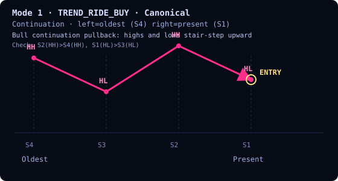
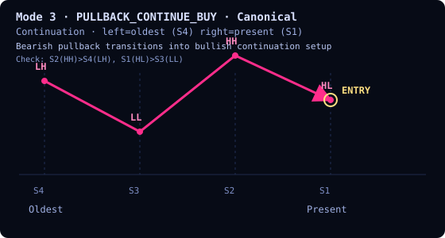

# Base Structure Compound Filter Market-Pattern Map (2026-02-14)

## Source of truth
- `services/core/enums.mqh` (`TrendStructureCompoundModes`)
- `services/trading_signals/structure_compound_modes.mqh`
  - `ResolveStructureCompoundCanonicalTemplate`
  - `EvaluateStructureCompoundMode`

## Visual conventions
- Diagrams are SVG zig-zag sketches in `docs/research/assets/structure-compound/`.
- Reading direction is fixed: **left = oldest**, **right = present**.
- Slot order in this document is **chronological**: `[fourth, third, second, first]`.
- Entry is marked only at the present point (right edge).
- No projection is drawn after entry.
- This map intentionally displays **canonical patterns only**.

## Label legend
- `HH`: Higher High
- `HL`: Higher Low
- `LH`: Lower High
- `LL`: Lower Low
- `EQ`: Equal / unchanged

## Resolver/evaluator notes
- Resolver tuple order in code remains `[first, second, third, fourth]`.
- This document intentionally reverses display order to `[fourth, third, second, first]` for oldest->present reading.
- `COMPOUND_MODE_OFF` short-circuits to pass.
- Active modes require at least 4 extrema.
- `EQ` is strict: expected `EQ` needs actual `EQ`; expected non-`EQ` rejects actual `EQ`.

## Mode index (canonical chronological slots)
| Mode | Enum | Family | Canonical `[fourth,third,second,first]` |
|---|---|---|---|
| 0 | `COMPOUND_MODE_OFF` | Disabled | n/a |
| 1 | `COMPOUND_MODE_TREND_RIDE_BUY` | Continuation | [HH, HL, HH, HL] |
| 2 | `COMPOUND_MODE_TREND_RIDE_SELL` | Continuation | [LL, LH, LL, LH] |
| 3 | `COMPOUND_MODE_PULLBACK_CONTINUE_BUY` | Continuation | [LH, LL, HH, HL] |
| 4 | `COMPOUND_MODE_PULLBACK_CONTINUE_SELL` | Continuation | [HL, HH, LL, LH] |
| 5 | `COMPOUND_MODE_REVERSAL_EARLY_BUY` | Reversion | [LH, LL, LH, HL] |
| 6 | `COMPOUND_MODE_REVERSAL_EARLY_SELL` | Reversion | [HL, HH, HL, LH] |
| 7 | `COMPOUND_MODE_BREAKOUT_READY_BUY` | Breakout | [HL, LH, HL, LH] |
| 8 | `COMPOUND_MODE_BREAKOUT_READY_SELL` | Breakout | [LH, HL, LH, HL] |
| 9 | `COMPOUND_MODE_VOLATILITY_TRAP_BUY` | Defensive | [HH, LL, HH, LL] |
| 10 | `COMPOUND_MODE_VOLATILITY_TRAP_SELL` | Defensive | [LL, HH, LL, HH] |

## OFF mode
### `COMPOUND_MODE_OFF` (0)
- Pattern filter is disabled and the structure gate passes immediately.
- No entry marker is used for this mode in this map.

## Continuation
### `COMPOUND_MODE_TREND_RIDE_BUY` (1)
Canonical chronological slots `[fourth,third,second,first]`: [HH, HL, HH, HL]

### `COMPOUND_MODE_TREND_RIDE_SELL` (2)
Canonical chronological slots `[fourth,third,second,first]`: [LL, LH, LL, LH]

### `COMPOUND_MODE_PULLBACK_CONTINUE_BUY` (3)
Canonical chronological slots `[fourth,third,second,first]`: [LH, LL, HH, HL]

### `COMPOUND_MODE_PULLBACK_CONTINUE_SELL` (4)
Canonical chronological slots `[fourth,third,second,first]`: [HL, HH, LL, LH]

## Reversion
### `COMPOUND_MODE_REVERSAL_EARLY_BUY` (5)
Canonical chronological slots `[fourth,third,second,first]`: [LH, LL, LH, HL]

### `COMPOUND_MODE_REVERSAL_EARLY_SELL` (6)
Canonical chronological slots `[fourth,third,second,first]`: [HL, HH, HL, LH]

## Breakout
### `COMPOUND_MODE_BREAKOUT_READY_BUY` (7)
Canonical chronological slots `[fourth,third,second,first]`: [HL, LH, HL, LH]

### `COMPOUND_MODE_BREAKOUT_READY_SELL` (8)
Canonical chronological slots `[fourth,third,second,first]`: [LH, HL, LH, HL]

## Defensive
### `COMPOUND_MODE_VOLATILITY_TRAP_BUY` (9)
Canonical chronological slots `[fourth,third,second,first]`: [HH, LL, HH, LL]

### `COMPOUND_MODE_VOLATILITY_TRAP_SELL` (10)
Canonical chronological slots `[fourth,third,second,first]`: [LL, HH, LL, HH]

## Edge cases
- Active mode + insufficient depth (`ArraySize(os_market_structures) < 4`) fails closed.
- Active mode + missing/invalid snapshot fails closed.
- Unknown mode fails when canonical resolution returns false.
- Direction is not encoded by this matcher; it is a pure structure gate.

## Validation links
- `tests/harness/cases/structure_compound_modes_test_case.mqh` (canonical match, mismatch, EQ strictness, fail-closed cases).

## Maintenance
- If enum modes change in `services/core/enums.mqh`, update this map and assets in the same PR.
- If canonical mapping changes in `services/trading_signals/structure_compound_modes.mqh`, regenerate affected SVGs and slot rows.
- Keep this document chronological `[fourth,third,second,first]` to preserve oldest->present readability.
