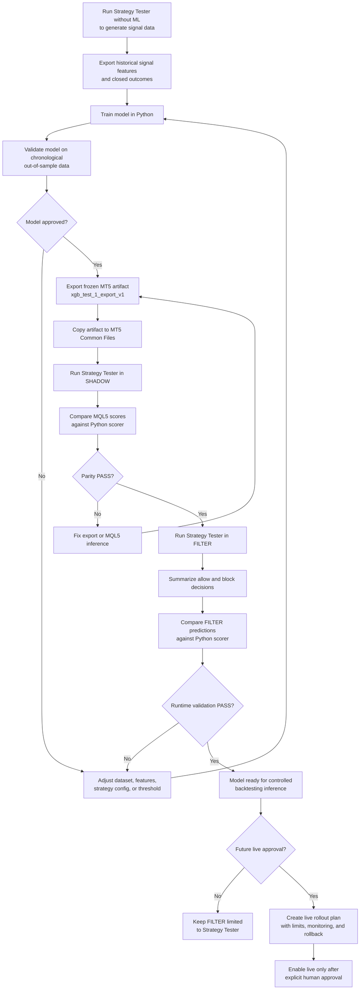
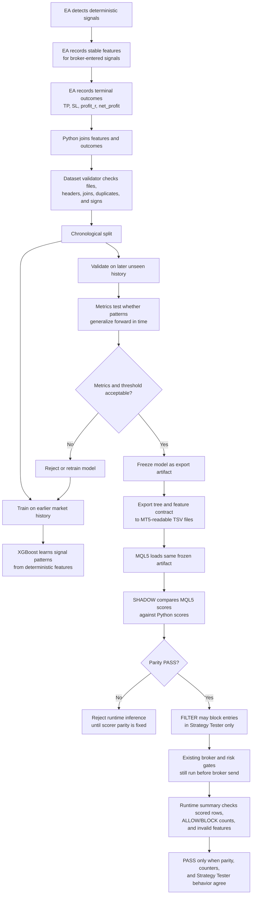

# Deterministic Signal ML Inference Flows

**Status**: Active workflow reference
**Created**: 2026-07-05

This document replaces the completed Phase 1-6 plans as the compact human and
agentic reference for deterministic signal ML use. Historical sprint plans and
acceptance evidence are archived under:

- `docs/plans/archive/deterministic-signal-ml-2026-07-05/`
- `docs/research/archive/deterministic-signal-ml-2026-07-05/`

`ML_INFERENCE_FILTER` is approved for Strategy Tester validation only. Live use
requires a future explicit plan, human approval, monitoring rules, and rollback
criteria.

## Use The Model For Backtesting Or Future Live Approval

## How The Model Learns And Why The Process Is Robust

## Current Accepted Runtime Evidence

- Export ID: `xgb_test_1_export_v1`
- Strategy Tester run ID: `shadow_test_run_1`
- Runtime mode: `ML_INFERENCE_FILTER`
- Prediction rows: `4846`
- Scored rows: `4846`
- Admission `ALLOW`: `301`
- Admission `BLOCK`: `4545`
- Invalid feature rows: `0`
- Unavailable rows: `0`
- Python/MQL5 decision agreement: `1`
- Result: Phase 6 Strategy Tester `FILTER` validation `PASS`
