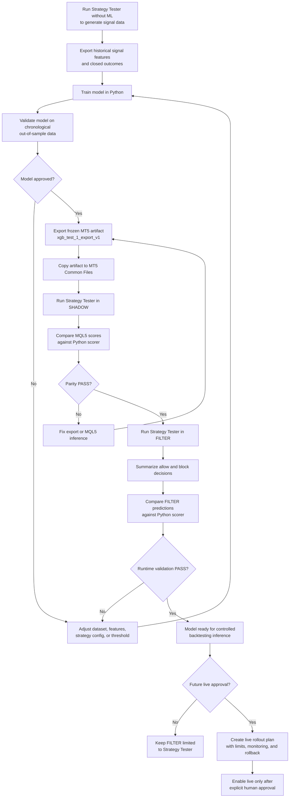
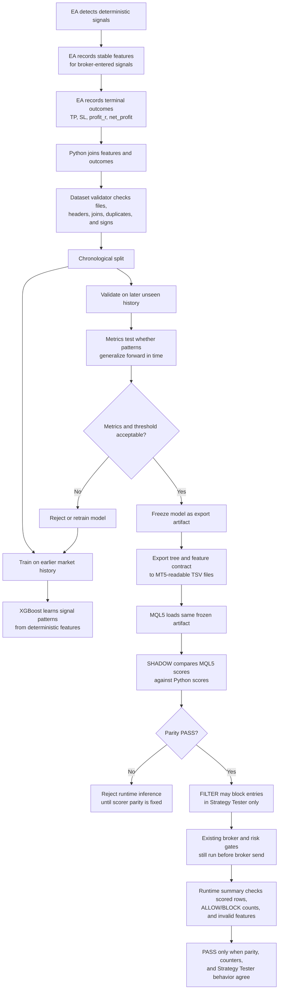

# Deterministic Signal ML Inference Flows

**Status**: Active workflow reference
**Created**: 2026-07-05

This document replaces the completed Phase 1-6 plans as the compact human and
agentic reference for deterministic signal ML use. Historical sprint plans and
acceptance evidence are archived under:

- `docs/plans/archive/deterministic-signal-ml-2026-07-05/`
- `docs/research/archive/deterministic-signal-ml-2026-07-05/`

`ML_INFERENCE_FILTER` is approved for Strategy Tester validation only. Live use
requires a future explicit plan, human approval, monitoring rules, and rollback
criteria.

Future model, threshold, feature-set, multi-symbol, or dynamic target approval
must use the hardened validation flow in
`docs/research/archive/ml-robustness-closeout-2026-07-09/ml-validation-hardening-acceptance.md`
or a newer active plan. The current short `test_dataset_1` / `xgb_test_1`
baseline is smoke evidence only; threshold selection for accepted research must
remain separate from final holdout approval.

## Use The Model For Backtesting Or Future Live Approval



## How The Model Learns And Why The Process Is Robust



## Current Accepted Runtime Evidence

- Export ID: `xgb_test_1_export_v1`
- Strategy Tester run ID: `shadow_test_run_1`
- Runtime mode: `ML_INFERENCE_FILTER`
- Prediction rows: `4846`
- Scored rows: `4846`
- Admission `ALLOW`: `301`
- Admission `BLOCK`: `4545`
- Invalid feature rows: `0`
- Unavailable rows: `0`
- Python/MQL5 decision agreement: `1`
- Result: Phase 6 Strategy Tester `FILTER` validation `PASS`

## Phase 2 Arbitration Validation

ML signal arbitration adds one more required artifact for post-implementation
FILTER smoke evidence:

```text
DeterministicSignalML/shadow_runs/<shadow_run_id>/arbitration_decisions.tsv
```

Before running Strategy Tester, deploy the current export to the same Common
Files root used by MT5:

```bash
export MT5_COMMON_FILES="$HOME/.wine/drive_c/users/loldlm/AppData/Roaming/MetaQuotes/Terminal/Common/Files"
.venv/bin/python tools/deterministic_signal_ml/deploy_model_export.py \
  --export-id xgb_test_1_export_v1 \
  --overwrite
```

After a fresh Phase 2 Strategy Tester FILTER run, use strict summary validation:

```bash
.venv/bin/python tools/deterministic_signal_ml/summarize_filter_run.py \
  --shadow-run-path "$MT5_COMMON_FILES/DeterministicSignalML/shadow_runs/<shadow_run_id>" \
  --require-arbitration
```

Current Phase 2 short XAUUSD smoke evidence:

- Shadow/filter run ID: `shadow_test_run_1`
- Runtime mode: `ML_INFERENCE_FILTER`
- Export ID: `xgb_test_1_export_v1`
- Prediction rows: `5329`
- Scored rows: `5329`
- Unavailable rows: `0`
- Admission `ALLOW`: `355`
- Admission `BLOCK`: `4974`
- Arbitration groups: `208`
- Multi-candidate groups: `112`
- Arbitration `SELECTED`: `208`
- Arbitration `BLOCKED`: `147`
- Python/MQL5 decision agreement: `1`
- Result: Phase 2 short Strategy Tester `FILTER` smoke `PASS`

If `shadow_manifest.tsv` records `available=false` with
`file_open_failed:DeterministicSignalML\model_exports\...`, the model export is
not deployed in the Common Files root used by MT5; deploy the export and rerun
Strategy Tester before interpreting FILTER or arbitration behavior.

## Archived Numeric XGBoost Research Contract

Phase 5 added schema v5 numeric XGBoost research and was archived on
2026-07-09. S1 schema v5 data export and training were technically validated,
but the S1 candidates were rejected for runtime promotion because no target
family produced an accepted threshold. Schema v4 semantic lanes remain
available for DuckDB pattern-audit research if a future plan resumes them.

Schema v5 numeric XGBoost model inputs:

```text
direction
stoch_structure_raw_percent
b_percent_main_base
b_percent_main_base_slope
b_percent_main_macro
b_percent_main_macro_slope
session_id
time_sin
time_cos
```

Feature rules:

- `direction` and `session_id` are categorical model inputs.
- `stoch_structure_raw_percent` is the source-extremum/SL-anchor raw percent
  behind `fib_sl_band`, not live close percent and not a raw oscillator value.
- `%B` features are derived from standard `iBands` logic handles with
  `period=21`, `deviation=2.0`, `bands_shift=0`, SMA base line,
  `PRICE_CLOSE`, confirmed non-forming values, and strategy-aligned candle
  shifts.
- Base `%B` is M1 with candle shift `3`, `5`, or `10` for S1/S2/S3.
- Macro `%B` is M3/M5/M10 with candle shift `1` for S1/S2/S3.
- Visual `iBands` with `bands_shift` and visual `BB_Percent_Standard`
  subwindows are QA-only and must not drive trading, feature extraction, risk
  gates, or runtime scoring.
- Path-ratio labels remain outcome-only and are excluded from model features.

Recommended one-strategy-at-a-time run IDs:

```text
xauusd_2025_schema_v5_numeric_run_S1
xauusd_2025_schema_v5_numeric_run_S2
xauusd_2025_schema_v5_numeric_run_S3
```

The detailed contract, evidence layout, and rejection evidence live in
`docs/research/archive/ml-robustness-closeout-2026-07-09/ml-numeric-xgboost-feature-spike.md`.
ONNX is not active; resume it only through a new `$planner` plan.

## Schema V4 Semantic Pattern Contract

Current Phase 3 follow-up work uses schema v4 semantic lanes. Do not reuse
schema v3 Strategy Tester exports, datasets, pattern audits, or model artifacts
as evidence for schema v4 approval.

Schema v4 active model/audit lanes:

```text
strategy_label
direction
structure_0
structure_1
structure_2
macro_h1_slope
macro_h4_slope
macro_d1_slope
fib_sl_band
fib_entry_band
high_chain_profile
low_chain_profile
previous_candle_profile
entry_session_bucket
entry_weekday
```

The existing broker-time session buckets remain active:

- `ASIA`: `00:00` through `06:59`
- `LONDON`: `07:00` through `11:59`
- `NEWYORK`: `12:00` through `20:59`
- `OFFHOURS`: `21:00` through `23:59`

For schema v4 data collection, run Strategy Tester with ML disabled and feature
export enabled. Generate S1, S2, and S3 separately before any combined run:

```text
xauusd_2025_schema_v4_run_S1
xauusd_2025_schema_v4_run_S2
xauusd_2025_schema_v4_run_S3
```

Use the deterministic XAUUSD window `2025-01-01` through `2026-01-01`. Keep the
same symbol, timeframe, risk, session, direction, and execution settings used
for the accepted schema v3 data collection unless a later plan explicitly
changes them. Only change the strategy booleans and run ID per run:

| Run ID | S1 | S2 | S3 |
| --- | --- | --- | --- |
| `xauusd_2025_schema_v4_run_S1` | `true` | `false` | `false` |
| `xauusd_2025_schema_v4_run_S2` | `false` | `true` | `false` |
| `xauusd_2025_schema_v4_run_S3` | `false` | `false` | `true` |

Required Strategy Tester inputs for all three fresh export runs:

- `Enable_Signal_Feature_Export = true`
- `Signal_Feature_Run_Id = <run ID from the table>`
- `ML_Inference_Mode = ML_INFERENCE_DISABLED`
- `Enable_Pattern_Audit_Overlay = false`
- `Pattern_Audit_Set_Id = ""`
- `Enable_Logs = false`
- `Enable_File_Logs = false`

After each run, build a schema v4 dataset and a strategy-scoped pattern audit
before running selected-pattern playback:

```bash
MT5_COMMON_FILES="$HOME/.wine/drive_c/users/loldlm/AppData/Roaming/MetaQuotes/Terminal/Common/Files"
RUNS_ROOT="$MT5_COMMON_FILES/DeterministicSignalML/runs"

.venv/bin/python tools/deterministic_signal_ml/build_dataset.py \
  --runs-root "$RUNS_ROOT" \
  --run-id xauusd_2025_schema_v4_run_S1 \
  --dataset-id xauusd_2025_schema_v4_dataset_S1 \
  --overwrite

.venv/bin/python tools/deterministic_signal_ml/pattern_audit.py \
  --dataset-id xauusd_2025_schema_v4_dataset_S1 \
  --audit-id xauusd_2025_schema_v4_audit_S1 \
  --strategy-label S1 \
  --overwrite
```

Repeat the dataset and audit commands for `S2` and `S3`.

## Schema V4 Depth-5 Research Gate

Current schema v4 research artifacts were built from the fresh XAUUSD
`2025-01-01` through `2026-01-01` S1/S2/S3 Strategy Tester exports:

| Strategy | Dataset ID | Training rows | Audit ID | Selected matches |
| --- | --- | ---: | --- | ---: |
| S1 | `xauusd_2025_schema_v4_dataset_S1` | 11911 | `xauusd_2025_schema_v4_audit_S1` | 3563 |
| S2 | `xauusd_2025_schema_v4_dataset_S2` | 12896 | `xauusd_2025_schema_v4_audit_S2` | 4157 |
| S3 | `xauusd_2025_schema_v4_dataset_S3` | 12236 | `xauusd_2025_schema_v4_audit_S3` | 3121 |

The schema v4 DuckDB pattern audits use semantic lanes only and allow up to
five conditions per pattern. The packages are already copied to Common Files:

```text
DeterministicSignalML/pattern_audits/xauusd_2025_schema_v4_audit_S1/
DeterministicSignalML/pattern_audits/xauusd_2025_schema_v4_audit_S2/
DeterministicSignalML/pattern_audits/xauusd_2025_schema_v4_audit_S3/
```

For the next human Strategy Tester parity pass, run one strategy at a time:

| Run | Strategy inputs | Pattern audit set |
| --- | --- | --- |
| S1 parity | `Enable_Strategy_1=true`, `Enable_Strategy_2=false`, `Enable_Strategy_3=false` | `xauusd_2025_schema_v4_audit_S1` |
| S2 parity | `Enable_Strategy_1=false`, `Enable_Strategy_2=true`, `Enable_Strategy_3=false` | `xauusd_2025_schema_v4_audit_S2` |
| S3 parity | `Enable_Strategy_1=false`, `Enable_Strategy_2=false`, `Enable_Strategy_3=true` | `xauusd_2025_schema_v4_audit_S3` |

Use these shared Strategy Tester inputs for each parity run:

- `Enable_Signal_Feature_Export = false`
- `ML_Inference_Mode = ML_INFERENCE_DISABLED`
- `Enable_Pattern_Audit_Overlay = true`
- `Pattern_Audit_Set_Id = <audit ID from the table>`
- `Enable_Logs = false`
- `Enable_File_Logs = true`

After each run, compare observed tester rows against the offline DuckDB matches:

```bash
MT5_COMMON_FILES="$HOME/.wine/drive_c/users/loldlm/AppData/Roaming/MetaQuotes/Terminal/Common/Files" \
.venv/bin/python tools/deterministic_signal_ml/pattern_playback_compare.py \
  --audit-id xauusd_2025_schema_v4_audit_S1
```

Repeat for `S2` and `S3`.

Depth-5 XGBoost candidates were also trained for S1, S2, S3, and combined
S1+S2+S3. Scorer export parity is OK, but no model has a robust final-holdout
threshold policy. The generated exports therefore remain research-only with
`mt5_runtime_ready=false` and must not be deployed for `ML_INFERENCE_FILTER`.

Current selected-pattern playback status:

| Audit ID | Pattern rows expected/observed/matched | Unique trades expected/observed/matched | Duplicate pattern hits | Decision |
| --- | ---: | ---: | ---: | --- |
| `xauusd_2025_schema_v4_audit_S1` | 3563 / 3563 / 3563 | 3078 / 3078 / 3078 | 485 | `DATA_CLEAR_CONTINUE_TO_PATH_LABELS` |
| `xauusd_2025_schema_v4_audit_S2` | 4157 / 4157 / 4157 | 3419 / 3419 / 3419 | 738 | `DATA_CLEAR_CONTINUE_TO_PATH_LABELS` |
| `xauusd_2025_schema_v4_audit_S3` | 3121 / 3121 / 3121 | 2351 / 2351 / 2351 | 770 | `DATA_CLEAR_CONTINUE_TO_PATH_LABELS` |

Per-pattern counts also match exactly for all 12 selected patterns in each
audit package. MT5 report totals should be compared with unique observed trade
entries, not pattern rows. `entry_time` and runtime `signal_id` differences in
older playback files are metadata diagnostics only; hard identity is
`pattern_id + source_key + source_attempt_index`.

Future playback observation files use schema version `2` and write expected and
observed signal/time metadata separately. The Python comparator remains
compatible with old schema version `1` observation files.

Phase 3 is complete for schema v4 research handoff. No schema v4 XGBoost model
has runtime ML FILTER approval. Schema v5 numeric XGBoost research is the next
active pre-ONNX feature-selection phase.

## Dynamic TP Path-Ratio Runbook

Phase 4 measures reward-ratio reachability from one path-aware export instead
of running a separate full-year Strategy Tester pass for each fixed TP.

Path-ratio labels are outcome-only. They must remain excluded from
`MODEL_FEATURE_COLUMNS`, pattern conditions, and MQL5 inference feature maps.

Outcome extension columns:

```text
hit_1r_before_sl
hit_1_5r_before_sl
hit_2r_before_sl
hit_3r_before_sl
max_favorable_r
max_adverse_r
bars_to_1r
bars_to_1_5r
bars_to_2r
bars_to_3r
bars_to_sl
path_horizon_bars
path_status
```

Performance rules for path-aware Strategy Tester runs:

- keep `Enable_Logs=false` and `Enable_File_Logs=false` for full-year exports
  unless debugging a specific failure
- keep Pattern Audit overlay disabled during bulk path export
- track virtual paths with bounded in-memory state and prune completed paths
- update path state from current tick prices; do not run full-history scans per
  tick
- use a short smoke run before any full-year path-aware export
- treat runtime TP changes as out of scope until a later execution plan
