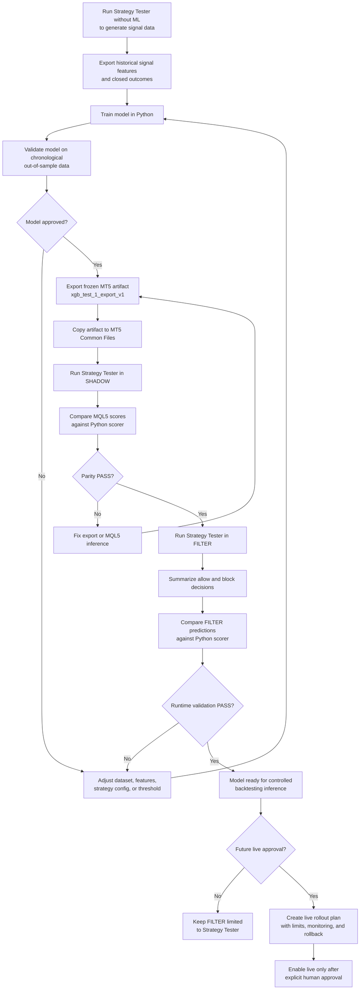
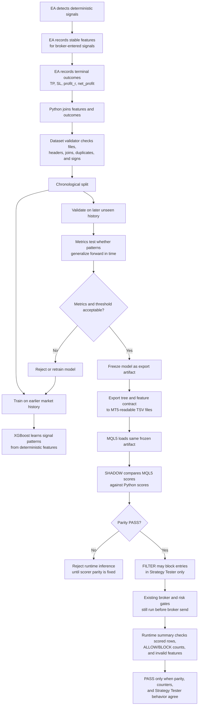

# Deterministic Signal ML Inference Flows

**Status**: Active workflow reference
**Created**: 2026-07-05

This document replaces the completed Phase 1-6 plans as the compact human and
agentic reference for deterministic signal ML use. Historical sprint plans and
acceptance evidence are archived under:

- `docs/plans/archive/deterministic-signal-ml-2026-07-05/`
- `docs/research/archive/deterministic-signal-ml-2026-07-05/`

`ML_INFERENCE_FILTER` is approved for Strategy Tester validation only. Live use
requires a future explicit plan, human approval, monitoring rules, and rollback
criteria.

Future model, threshold, feature-set, multi-symbol, or dynamic target approval
must use the hardened validation flow in
`docs/research/ml-validation-hardening-acceptance.md`. The current short
`test_dataset_1` / `xgb_test_1` baseline is smoke evidence only; threshold
selection for accepted research must remain separate from final holdout
approval.

## Use The Model For Backtesting Or Future Live Approval



## How The Model Learns And Why The Process Is Robust



## Current Accepted Runtime Evidence

- Export ID: `xgb_test_1_export_v1`
- Strategy Tester run ID: `shadow_test_run_1`
- Runtime mode: `ML_INFERENCE_FILTER`
- Prediction rows: `4846`
- Scored rows: `4846`
- Admission `ALLOW`: `301`
- Admission `BLOCK`: `4545`
- Invalid feature rows: `0`
- Unavailable rows: `0`
- Python/MQL5 decision agreement: `1`
- Result: Phase 6 Strategy Tester `FILTER` validation `PASS`

## Phase 2 Arbitration Validation

ML signal arbitration adds one more required artifact for post-implementation
FILTER smoke evidence:

```text
DeterministicSignalML/shadow_runs/<shadow_run_id>/arbitration_decisions.tsv
```

Before running Strategy Tester, deploy the current export to the same Common
Files root used by MT5:

```bash
export MT5_COMMON_FILES="$HOME/.wine/drive_c/users/loldlm/AppData/Roaming/MetaQuotes/Terminal/Common/Files"
.venv/bin/python tools/deterministic_signal_ml/deploy_model_export.py \
  --export-id xgb_test_1_export_v1 \
  --overwrite
```

After a fresh Phase 2 Strategy Tester FILTER run, use strict summary validation:

```bash
.venv/bin/python tools/deterministic_signal_ml/summarize_filter_run.py \
  --shadow-run-path "$MT5_COMMON_FILES/DeterministicSignalML/shadow_runs/<shadow_run_id>" \
  --require-arbitration
```

Current Phase 2 short XAUUSD smoke evidence:

- Shadow/filter run ID: `shadow_test_run_1`
- Runtime mode: `ML_INFERENCE_FILTER`
- Export ID: `xgb_test_1_export_v1`
- Prediction rows: `5329`
- Scored rows: `5329`
- Unavailable rows: `0`
- Admission `ALLOW`: `355`
- Admission `BLOCK`: `4974`
- Arbitration groups: `208`
- Multi-candidate groups: `112`
- Arbitration `SELECTED`: `208`
- Arbitration `BLOCKED`: `147`
- Python/MQL5 decision agreement: `1`
- Result: Phase 2 short Strategy Tester `FILTER` smoke `PASS`

If `shadow_manifest.tsv` records `available=false` with
`file_open_failed:DeterministicSignalML\model_exports\...`, the model export is
not deployed in the Common Files root used by MT5; deploy the export and rerun
Strategy Tester before interpreting FILTER or arbitration behavior.

## Active Feature Research Contract

Current Phase 3 follow-up work uses schema v4 semantic lanes. Do not reuse
schema v3 Strategy Tester exports, datasets, pattern audits, or model artifacts
as evidence for schema v4 approval.

Schema v4 active model/audit lanes:

```text
strategy_label
direction
structure_0
structure_1
structure_2
macro_h1_slope
macro_h4_slope
macro_d1_slope
fib_sl_band
fib_entry_band
high_chain_profile
low_chain_profile
previous_candle_profile
entry_session_bucket
entry_weekday
```

The existing broker-time session buckets remain active:

- `ASIA`: `00:00` through `06:59`
- `LONDON`: `07:00` through `11:59`
- `NEWYORK`: `12:00` through `20:59`
- `OFFHOURS`: `21:00` through `23:59`

For schema v4 data collection, run Strategy Tester with ML disabled and feature
export enabled. Generate S1, S2, and S3 separately before any combined run:

```text
xauusd_2025_schema_v4_run_S1
xauusd_2025_schema_v4_run_S2
xauusd_2025_schema_v4_run_S3
```

Use the deterministic XAUUSD window `2025-01-01` through `2026-01-01`. Keep the
same symbol, timeframe, risk, session, direction, and execution settings used
for the accepted schema v3 data collection unless a later plan explicitly
changes them. Only change the strategy booleans and run ID per run:

| Run ID | S1 | S2 | S3 |
| --- | --- | --- | --- |
| `xauusd_2025_schema_v4_run_S1` | `true` | `false` | `false` |
| `xauusd_2025_schema_v4_run_S2` | `false` | `true` | `false` |
| `xauusd_2025_schema_v4_run_S3` | `false` | `false` | `true` |

Required Strategy Tester inputs for all three fresh export runs:

- `Enable_Signal_Feature_Export = true`
- `Signal_Feature_Run_Id = <run ID from the table>`
- `ML_Inference_Mode = ML_INFERENCE_DISABLED`
- `Enable_Pattern_Audit_Overlay = false`
- `Pattern_Audit_Set_Id = ""`
- `Enable_Logs = false`
- `Enable_File_Logs = false`

After each run, build a schema v4 dataset and a strategy-scoped pattern audit
before running selected-pattern playback:

```bash
MT5_COMMON_FILES="$HOME/.wine/drive_c/users/loldlm/AppData/Roaming/MetaQuotes/Terminal/Common/Files"
RUNS_ROOT="$MT5_COMMON_FILES/DeterministicSignalML/runs"

.venv/bin/python tools/deterministic_signal_ml/build_dataset.py \
  --runs-root "$RUNS_ROOT" \
  --run-id xauusd_2025_schema_v4_run_S1 \
  --dataset-id xauusd_2025_schema_v4_dataset_S1 \
  --overwrite

.venv/bin/python tools/deterministic_signal_ml/pattern_audit.py \
  --dataset-id xauusd_2025_schema_v4_dataset_S1 \
  --audit-id xauusd_2025_schema_v4_audit_S1 \
  --strategy-label S1 \
  --overwrite
```

Repeat the dataset and audit commands for `S2` and `S3`.
